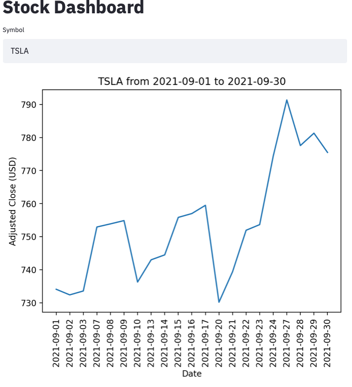

# Stock Market Dashboard

#### Manveer Sadhal
#### Oct 12, 2021

## Question
The goal of this project is to create a data pipeline which automatically updates with information about publicly traded stocks. The information will be delivered to the user via an interactive dashboard.

## Data
The top 2000 Nasdaq companies by market cap were selected for the initial version of this data pipeline and corresponding dashboard. Stock price at the close of each day was collected going back to 2011.

## Preliminary Results
Stock price data was retrieved using the Pandas DataReader library, connecting to Yahoo finance as the data source. Data was then stored in a local database.

Using Streamlit, a basic interactive app has been created to allow users to enter different stock symbols and retrieve a chart of the adjusted price at market close. A short video demonstrating the app is available [here](https://youtu.be/Ge2REy8EgqY).

## Further Work
The data set will be expanded to include more stock symbols and covering a longer time period. The data will be automatically updated with a scheduled script at the end of each trading day.

Fundamental data will be added to the dashboard (e.g. sector, price-to-earnings ratio, market cap, earnings-per-share ratio). Additional interactive features will be added.

Data has been loaded to Google BigQuery, but the queries are extremely slow in the Streamlit app. If latency can be reduced to an acceptable level, the final app will retrieve data from BigQuery or another Google Cloud Platform product.

The app will be published to the web using Heroku rather than running locally.
